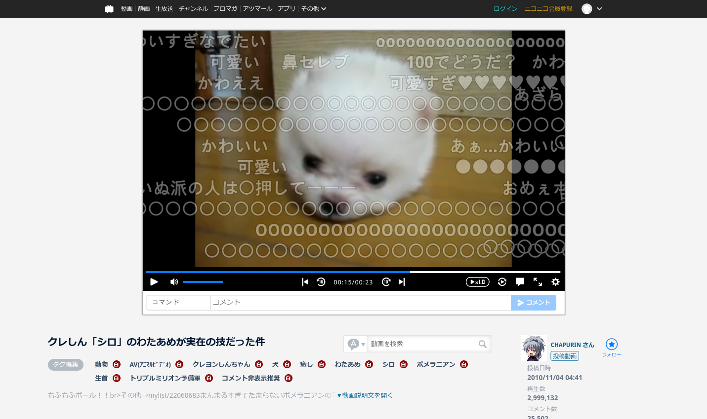
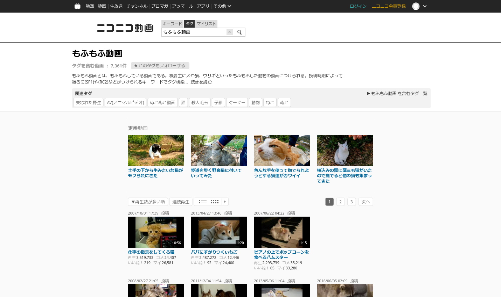

<!-- memo

(1)

do not forget to update @version in uc-template.css (AND compile again)
otherwise stylus's auto-update does not work.

(2)

css is uploaded to https://userstyles.world/style/4361/niconico-clean
it mirrors (1) source code and (2) image from github

userstyles.world is a better alternative to userstyles.org

currently all.scss is compiled and merged with userstyle header, then output to niconico-clean.user.css

output file name must end with .user.css and the file must contain header at the beginning.
then the css is recognized "as Usercss" by stylus, and can be uploaded to userstyles.world

-->

# Niconico clean usercss theme

 

<!--
zoom 133%

https://www.nicovideo.jp/watch/sm12641376
at 00:15

https://www.nicovideo.jp/tag/もふもふ動画?sort=v&order=d
-->

### Installation
1. Install [Stylus for Chrome](https://chrome.google.com/webstore/detail/stylus/clngdbkpkpeebahjckkjfobafhncgmne) or [Stylus for Firefox](https://addons.mozilla.org/firefox/addon/styl-us/).
2. Install CSS from [userstyles.world](https://userstyles.world/style/4361/niconico-clean) (or [direct link](https://raw.githubusercontent.com/sj2tpgk/niconico-clean/master/niconico-clean.user.css)).

